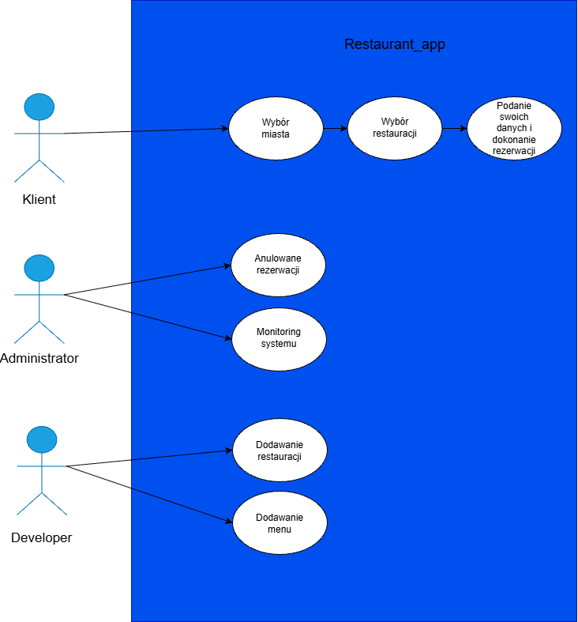
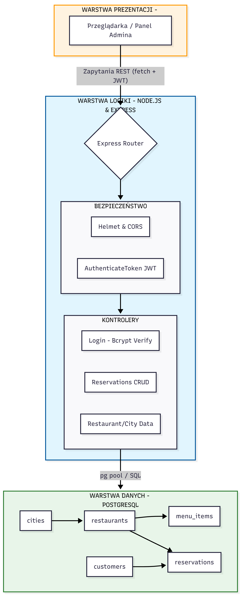
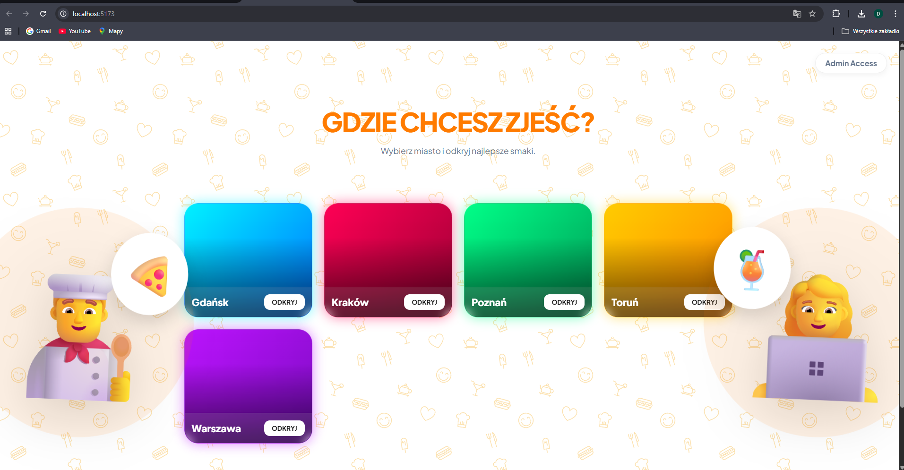
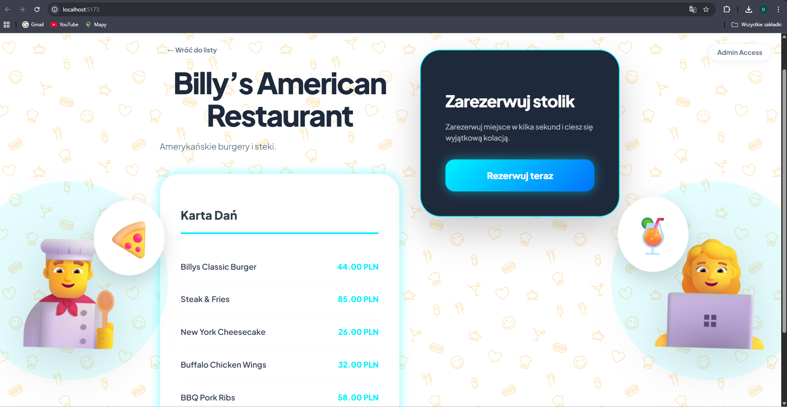
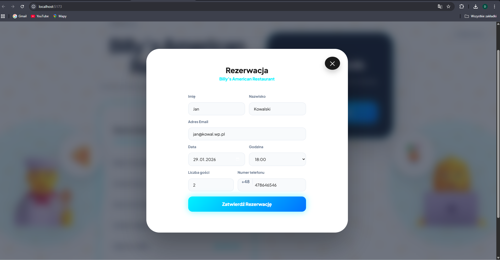
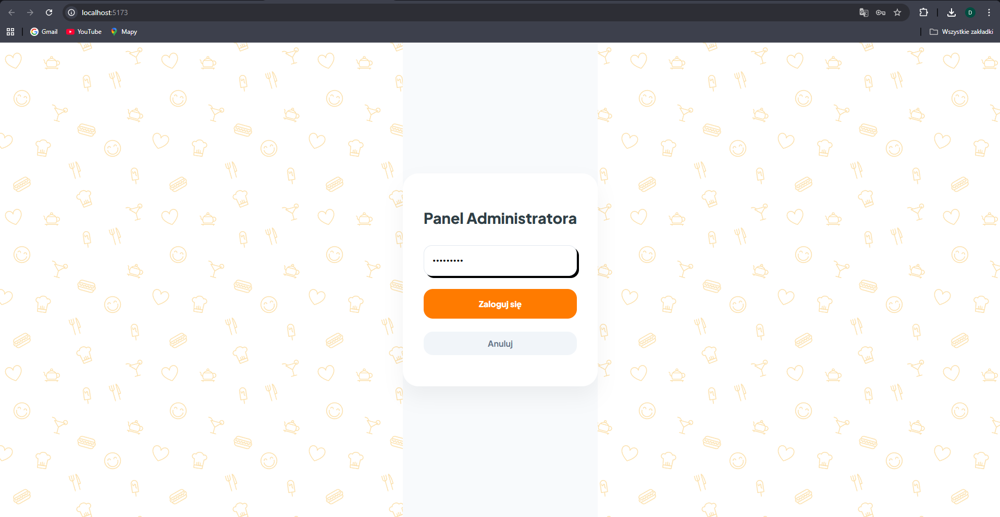
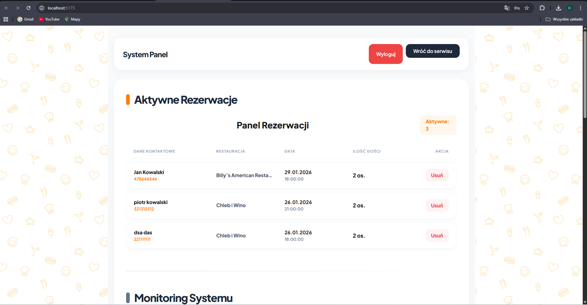
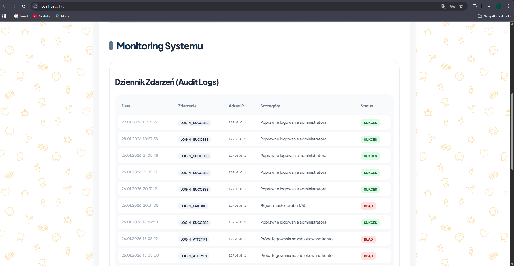

STRONA TYTUŁOWA

Uczelnia: Uniwersytet Merito Toruń
Kierunek: Informatyka w Biznesie 

<br>
<br>
<br>

Projekt Inżynierski

Projekt i implementacja nowoczesnego systemu rezerwacji stolików z zaawansowanym modułem zarządzania i bezpieczeństwa danych w sektorze gastronomicznym
<br>
<br>

Autorzy: Hubert Pawlak, Bartłomiej Niemyjski, Dominik Drożdżewski  

<br>

Promotor: Cezary Graul 

<br>
<br>
<br>
<br>

Toruń, 2026

## Spis treści
- [Spis treści](#spis-treści)
- [1. Streszczenie i Abstract](#1-streszczenie-i-abstract)
  - [1.1. Streszczenie](#11-streszczenie)
  - [1.2. Abstract](#12-abstract)
- [2. Wstęp](#2-wstęp)
  - [2.1. Cel pracy](#21-cel-pracy)
  - [2.2. Zakres projektu](#22-zakres-projektu)
  - [2.3. Metodyka realizacji](#23-metodyka-realizacji)
  - [2.4. Struktura pracy](#24-struktura-pracy)
- [3. Charakterystyka problemu i kontekstu biznesowego](#3-charakterystyka-problemu-i-kontekstu-biznesowego)
  - [3.1. Opis domeny i branży](#31-opis-domeny-i-branży)
  - [3.2. Opis aktualnego sposobu działania (proces „przed systemem”)](#32-opis-aktualnego-sposobu-działania-proces-przed-systemem)
  - [3.3. Identyfikacja problemów](#33-identyfikacja-problemów)
  - [3.4. Cele biznesowe wdrożenia systemu](#34-cele-biznesowe-wdrożenia-systemu)
  - [3.5. Identyfikacja interesariuszy i ich potrzeb](#35-identyfikacja-interesariuszy-i-ich-potrzeb)
- [4. Wymagania systemu](#4-wymagania-systemu)
  - [4.1. Wymagania funkcjonalne](#41-wymagania-funkcjonalne)
  - [4.2. Wymagania niefunkcjonalne](#42-wymagania-niefunkcjonalne)
  - [4.3. Wymagania techniczne](#43-wymagania-techniczne)
  - [4.4. Przypadki użycia (Use Case)](#44-przypadki-użycia-use-case)
    - [UC1: Złożenie rezerwacji przez Klienta](#uc1-złożenie-rezerwacji-przez-klienta)
    - [UC2: Logowanie do panelu administratora](#uc2-logowanie-do-panelu-administratora)
    - [UC3: Monitoring prób nieautoryzowanego dostępu](#uc3-monitoring-prób-nieautoryzowanego-dostępu)
- [5. Projekt systemu](#5-projekt-systemu)
  - [5.1. Architektura systemu](#51-architektura-systemu)
  - [5.2. Model danych](#52-model-danych)
  - [5.3. Projekt interfejsu użytkownika](#53-projekt-interfejsu-użytkownika)
  - [5.4. Logika działania](#54-logika-działania)
- [6. Implementacja rozwiązania](#6-implementacja-rozwiązania)
  - [6.1. Zastosowane technologie i narzędzia](#61-zastosowane-technologie-i-narzędzia)
  - [6.2. Struktura projektu](#62-struktura-projektu)
  - [6.3. Wybrane elementy implementacji](#63-wybrane-elementy-implementacji)
    - [6.3.1. Mechanizm bezpiecznej autoryzacji i sesji](#631-mechanizm-bezpiecznej-autoryzacji-i-sesji)
- [7. Testowanie](#7-testowanie)
  - [7.1. Zakres i strategia testów](#71-zakres-i-strategia-testów)
  - [7.2. Scenariusze testowe](#72-scenariusze-testowe)
  - [7.3. Wyniki testów i wnioski](#73-wyniki-testów-i-wnioski)
- [8. Instrukcja uruchomienia i użytkowania](#8-instrukcja-uruchomienia-i-użytkowania)
  - [8.1. Wymagania instalacyjne](#81-wymagania-instalacyjne)
  - [8.2. Instrukcja uruchomienia](#82-instrukcja-uruchomienia)
    - [8.2.1. Przygotowanie bazy danych](#821-przygotowanie-bazy-danych)
    - [8.2.2. Uruchomienie aplikacji](#822-uruchomienie-aplikacji)
  - [8.3. Instrukcja użytkownika](#83-instrukcja-użytkownika)
    - [8.3.1. Rezerwacja stolika (Widok Klienta)](#831-rezerwacja-stolika-widok-klienta)
    - [8.3.2. Zarządzanie systemem (Widok Administratora)](#832-zarządzanie-systemem-widok-administratora)
    - [8.3.3. Ścieżki nawigacji](#833-ścieżki-nawigacji)
- [9. Aspekty biznesowe, bezpieczeństwo i dane](#9-aspekty-biznesowe-bezpieczeństwo-i-dane)
  - [9.1. Korzyści biznesowe wdrożenia systemu](#91-korzyści-biznesowe-wdrożenia-systemu)
  - [9.2. Bezpieczeństwo i spójność danych](#92-bezpieczeństwo-i-spójność-danych)
  - [9.3. Ochrona danych osobowych (Zgodność z RODO)](#93-ochrona-danych-osobowych-zgodność-z-rodo)
- [10. Podsumowanie i dalszy rozwój](#10-podsumowanie-i-dalszy-rozwój)
  - [10.1. Podsumowanie realizacji celu pracy](#101-podsumowanie-realizacji-celu-pracy)
  - [10.2. Wnioski autora](#102-wnioski-autora)
  - [10.3. Kierunki dalszego rozwoju systemu](#103-kierunki-dalszego-rozwoju-systemu)
- [11. Wykaz ważniejszych skrótów i pojęć](#11-wykaz-ważniejszych-skrótów-i-pojęć)
- [12. Bibliografia](#12-bibliografia)
- [13. Spis rysunków](#13-spis-rysunków)
- [14. Załączniki](#14-załączniki)
<div style="page-break-after: always;"></div>


## 1. Streszczenie i Abstract

### 1.1. Streszczenie 

Głównym celem niniejszego projektu inżynierskiego było zaprojektowanie oraz implementacja nowoczesnego i bezpiecznego systemu webowego do zarządzania rezerwacjami stolików w lokalach gastronomicznych. System powstał jako odpowiedź na rzeczywiste potrzeby branży, dążącej do automatyzacji procesów obsługi klienta przy jednoczesnym zapewnieniu wysokiej integralności oraz poufności gromadzonych danych. 

Opracowane rozwiązanie oferuje szeroki zakres funkcjonalności, podzielonych na moduły dla klienta końcowego oraz administratora. Klient ma możliwość dokonania rezerwacji za pośrednictwem intuicyjnego formularza, który w czasie rzeczywistym waliduje poprawność wprowadzanych danych. Z kolei panel administracyjny pozwala na pełne zarządzanie bazą rezerwacji, umożliwiając ich przeglądanie, filtrowanie oraz usuwanie. Kluczowym elementem systemu jest zaawansowany moduł monitoringu (Audit Logs), który rejestruje każdą próbę logowania i operacje systemowe, zapewniając pełną rozliczalność działań.

W procesie wytwórczym wykorzystano nowoczesne technologie webowe z ekosystemu JavaScript. Warstwa prezentacji została zbudowana z wykorzystaniem biblioteki **React.js**, zapewniającej responsywność i dynamiczne działanie interfejsu. Warstwa logiki biznesowej opiera się na środowisku **Node.js** wraz z frameworkiem **Express**, natomiast trwałość danych gwarantuje relacyjna baza danych **PostgreSQL**. Bezpieczeństwo systemu zrealizowano poprzez zastosowanie mechanizmów takich jak hashowanie haseł algorytmem **Bcrypt**, autoryzacja za pomocą tokenów **JWT** (JSON Web Token) oraz rygorystyczna walidacja danych wejściowych z użyciem biblioteki **Zod**.

Najważniejszym rezultatem projektu jest dostarczenie stabilnej aplikacji, która znacząco usprawnia procesy biznesowe w restauracji. Korzyści wynikające z wdrożenia systemu obejmują eliminację błędów wynikających z manualnego prowadzenia zapisów, zwiększenie bezpieczeństwa danych osobowych klientów oraz dostarczenie kadrze menedżerskiej narzędzi do monitorowania bezpieczeństwa systemu w czasie rzeczywistym.

---

### 1.2. Abstract 

The primary objective of this engineering project was to design and implement a modern and secure web-based system for managing table reservations in catering establishments. The system was developed in response to the actual needs of the industry, aiming to automate customer service processes while ensuring high integrity and confidentiality of the collected data.

The developed solution offers a wide range of functionalities, divided into modules for the end customer and the administrator. Customers can make reservations through an intuitive form that validates the correctness of the entered data in real time. The administrative panel, on the other hand, allows for full management of the reservation database, including viewing, filtering, and deleting records. A key component of the system is an advanced monitoring module (Audit Logs), which records every login attempt and system operation, ensuring full accountability of actions.

Modern web technologies from the JavaScript ecosystem were used in the development process. The presentation layer was built using the **React.js** library, ensuring interface responsiveness and dynamic performance. The business logic layer is based on the **Node.js** environment with the **Express** framework, while data durability is guaranteed by the **PostgreSQL** relational database. System security was implemented through mechanisms such as the **Bcrypt** hashing algorithm, **JWT** (JSON Web Token) authorization, and rigorous input data validation using the **Zod** library.

The most significant result of the project is the delivery of a stable application that significantly improves business processes in a restaurant. The benefits of implementing the system include the elimination of errors resulting from manual record-keeping, increased security of customers' personal data, and providing management with tools to monitor system security in real time.

## 2. Wstęp

### 2.1. Cel pracy
Głównym celem niniejszej pracy inżynierskiej jest zaprojektowanie, implementacja oraz dokumentacja kompletnego systemu informatycznego do zarządzania rezerwacjami stolików w branży gastronomicznej. Stworzono rozwiązanie, które nie tylko zautomatyzuje procesy przyjmowania zgłoszeń od klientów, ale przede wszystkim podniesie standardy bezpieczeństwa danych w systemach restauracyjnych. Istotnym aspektem było zbudowanie narzędzia pozwalającego na pełną kontrolę nad dostępem do zasobów administratora oraz zapewnienie rozliczalności działań poprzez zaawansowane mechanizmy logowania zdarzeń (Audit Logs). Projekt ma na celu pokazanie, w jaki sposób nowoczesne technologie webowe mogą zostać wykorzystane do optymalizacji procesów biznesowych przy zachowaniu rygorystycznych norm ochrony danych.

### 2.2. Zakres projektu

* **Część projektu wchodząca w zakres pracy:**
    * Projekt i implementacja relacyjnej bazy danych PostgreSQL.
    * Budowa serwera API (Backend) obsługującego logikę biznesową, autoryzację JWT oraz walidację danych.
    * Opracowanie responsywnego interfejsu użytkownika (Frontend) dla klientów oraz administratorów.
    * Wdrożenie pakietu zabezpieczeń: hashowanie Bcrypt, Rate Limiting, Sanityzacja danych oraz polityka blokady konta.
    * Stworzenie modułu Audit Logs do monitorowania bezpieczeństwa.
* **Część projektu pozostająca poza zakresem pracy:**
    * Integracja z systemami płatności online.
    * Moduł zarządzania dostawami jedzenia (dowóz do klienta).
    * Natywne aplikacje mobilne (system opiera się na architekturze Web).

### 2.3. Metodyka realizacji
Praca nad systemem prowadzona była w modelu iteracyjnym. Podejście to pozwoliło na elastyczne reagowanie na pojawiające się wyzwania techniczne, szczególnie w obszarze integracji warstwy serwerowej z bazą danych. Proces wytwórczy został podzielony na cykle, z których każdy kończył się testami konkretnej funkcjonalności – od fundamenów bazy danych, przez logikę API, po zabezpieczenia interfejsu. Taka metodyka umożliwiła wczesne wykrywanie potencjalnych luk w bezpieczeństwie i ich sukcesywną eliminację.

### 2.4. Struktura pracy

1. **Streszczenie i Abstract** – zawiera zwięzły opis celów, technologii i rezultatów projektu w języku polskim i angielskim.
2. **Wstęp** – definiuje ramy pracy, jej cel, zakres oraz zastosowaną metodykę wytwórczą.
3. **Charakterystyka problemu i kontekstu biznesowego** – opisuje domenę gastronomiczną i uzasadnia potrzebę wdrożenia systemu z punktu widzenia biznesu.
4. **Wymagania systemu** – szczegółowo zestawia oczekiwane funkcjonalności oraz wymagania niefunkcjonalne, w tym standardy bezpieczeństwa.
5. **Projekt systemu** – przedstawia architekturę techniczną, model danych (ERD) oraz koncepcję interfejsu użytkownika.
6. **Implementacja rozwiązania** – opisuje proces budowy aplikacji, wybrane technologie oraz kluczowe mechanizmy bezpieczeństwa wraz z fragmentami kodu.
7. **Testowanie** – dokumentuje przeprowadzone testy poprawności i testy penetracyjne, potwierdzając stabilność rozwiązania.
8. **Instrukcja uruchomienia i użytkowania** – zawiera techniczne wytyczne dotyczące instalacji oraz obsługi gotowej aplikacji.
9. **Aspekty biznesowe, bezpieczeństwo i dane** – analizuje korzyści z wdrożenia, zgodność z RODO oraz spójność danych.
10. **Podsumowanie i dalszy rozwój** – weryfikuje osiągnięcie celów i kreśli wizję przyszłej rozbudowy systemu.
11. **Bibliografia i Załączniki** – zestawia źródła wiedzy oraz dodatkowe materiały techniczne.

## 3. Charakterystyka problemu i kontekstu biznesowego

### 3.1. Opis domeny i branży
Projekt koncentruje się na branży gastronomicznej, a dokładniej na sektorze zarządzania obsługą gości w restauracjach o profilu stolikowym. Jest to domena wymagająca wysokiej precyzji w gospodarowaniu zasobami (dostępne miejsca) oraz czasem. W dobie rosnącej cyfryzacji usług, sektor ten staje przed wyzwaniem przejścia z tradycyjnych metod komunikacji na nowoczesne kanały cyfrowe, które stają się standardem rynkowym oczekiwanym przez współczesnych konsumentów.

### 3.2. Opis aktualnego sposobu działania (proces „przed systemem”)
W tradycyjnym modelu pracy, który system ma zastąpić, proces rezerwacji opiera się głównie na kontakcie telefonicznym lub osobistym. Pracownik restauracji (hostessa lub kelner) przyjmuje zgłoszenie i manualnie nanosi dane do fizycznego kalendarza lub arkusza papierowego. Weryfikacja dostępności stolika odbywa się poprzez wzrokowy przegląd zapisanych notatek, co w godzinach szczytu jest procesem obarczonym dużym ryzykiem błędu. Brak centralnej, cyfrowej bazy powoduje, że informacja o rezerwacji jest dostępna tylko dla osób mających fizyczny dostęp do notatnika.

### 3.3. Identyfikacja problemów 

* **Błędy ludzkie:** Najczęstszym problemem jest dublowanie rezerwacji na ten sam stolik  oraz błędne zapisanie danych kontaktowych, co uniemożliwia kontakt z klientem.
* **Czasochłonność:** Przyjmowanie rezerwacji telefonicznych odciąga personel od bezpośredniej obsługi gości znajdujących się w lokalu.
* **Brak raportowania i analityki:** Dane zapisane na papierze są nieprzydatne do analizy obłożenia lokalu, trendów godzinowych czy tworzenia bazy lojalnościowej klientów.
* **Ryzyko utraty danych:** Fizyczny notes może zostać zniszczony lub zgubiony, co prowadzi do utraty informacji o wszystkich przyszłych rezerwacjach i paraliżu pracy restauracji.
* **Brak standardów bezpieczeństwa:** Dane osobowe klientów (imiona, numery telefonów) są widoczne dla każdej osoby postronnej mającej wgląd w notatki personelu.

### 3.4. Cele biznesowe wdrożenia systemu

* **Automatyzacja procesów:** Skrócenie czasu potrzebnego na przyjęcie rezerwacji poprzez przeniesienie ciężaru wprowadzania danych na klienta.
* **Optymalizacja zasobów:** Lepsze wykorzystanie przestrzeni lokalu dzięki precyzyjnemu przypisywaniu osób do stolików.
* **Zwiększenie dostępności:** Umożliwienie klientom dokonywania rezerwacji 24 godziny na dobę, 7 dni w tygodniu, niezależnie od godzin otwarcia lokalu i obłożenia personelu.
* **Poprawa bezpieczeństwa danych:** Wprowadzenie rygorystycznej kontroli dostępu do danych osobowych oraz logowania operacji administratora.
* **Budowa przewagi konkurencyjnej:** Nowoczesny wizerunek restauracji jako miejsca przyjaznego technologiom i szanującego czas klienta.

### 3.5. Identyfikacja interesariuszy i ich potrzeb

| Grupa interesariuszy | Potrzeby i oczekiwania wobec systemu |
| :--- | :--- |
| **Klienci restauracji** | Szybki i intuicyjny proces rezerwacji, natychmiastowe potwierdzenie, pewność ochrony danych osobowych, dostępność usługi na urządzeniach mobilnych. |
| **Administrator / Manager** | Przejrzysty wgląd w listę rezerwacji, narzędzia do edycji i usuwania błędnych wpisów, bezpieczeństwo panelu zarządzania, monitoring prób nieautoryzowanego dostępu (Audit Logs). |
| **Właściciel biznesu** | Stabilność systemu, minimalizacja strat wynikających z błędów personelu, posiadanie wiarygodnych danych o ruchu w lokalu. |

## 4. Wymagania systemu

### 4.1. Wymagania funkcjonalne

| ID | Nazwa funkcjonalności | Aktor | Opis funkcjonalności i cel |
| :--- | :--- | :--- | :--- |
| **WF1** | Formularz rezerwacji | Klient | Możliwość wprowadzenia danych (imię, e-mail, liczba osób, data). Cel: Rejestracja nowej rezerwacji w bazie danych. |
| **WF2** | Autoryzacja administratora | Administrator | Zabezpieczony formularz logowania z weryfikacją hasła. Cel: Uzyskanie dostępu do panelu zarządzania. |
| **WF3** | Zarządzanie rezerwacjami | Administrator | Wyświetlanie listy wszystkich rezerwacji w formie tabeli. Cel: Podgląd obłożenia lokalu. |
| **WF4** | Usuwanie rezerwacji | Administrator | Możliwość permanentnego usunięcia wybranego wpisu. Cel: Porządkowanie bazy danych i obsługa rezygnacji. |
| **WF5** | Rejestracja zdarzeń (Audit Logs) | System | Automatyczne zapisywanie logów logowania i błędów. Cel: Monitoring bezpieczeństwa i działań admina. |
| **WF6** | Walidacja danych | System | Sprawdzanie poprawności formatu e-mail i limitu osób. Cel: Zapewnienie spójności i jakości danych. |

### 4.2. Wymagania niefunkcjonalne

* **Bezpieczeństwo:**
    * Hasła administratora muszą być przechowywane w formie zahashowanej (Bcrypt).
    * Sesja administratora musi być chroniona tokenami JWT przechowywanymi w bezpiecznych ciasteczkach (HttpOnly).
    * System musi blokować dostęp po 5 nieudanych próbach logowania (Account Lockout Policy).
* **Wydajność:**
    * Czas odpowiedzi serwera na standardowe żądania API nie powinien przekraczać 200 ms.
    * Aplikacja frontendowa musi ładować się w czasie poniżej 1,5 sekundy przy standardowym łączu internetowym.
* **Niezawodność:**
    * Serwer musi obsługiwać mechanizm Rate Limitingu, aby zapobiegać przeciążeniom oraz atakom typu DoS.
* **Użyteczność:**
    * Interfejs musi być responsywny, umożliwiając wygodną obsługę na komputerach i urządzeniach mobilnych.
    * Komunikaty o błędach muszą być czytelne i informować użytkownika o przyczynie niepowodzenia (np. błędny format e-mail).

### 4.3. Wymagania techniczne
* **Przeglądarki:** Wsparcie dla najnowszych wersji Chrome, Firefox, Safari oraz Edge.
* **Backend:** Środowisko uruchomieniowe Node.js (wersja 18 lub nowsza).
* **Baza danych:** System PostgreSQL w wersji 14 lub nowszej.
* **Dostęp:** Wymagane stałe połączenie z Internetem dla komunikacji warstwy prezentacji z API.

### 4.4. Przypadki użycia (Use Case)

<br>
<figure style="text-align: center;">
    
    <figcaption style="font-size: 0.9em; color: gray; margin-top: 10px;">
        <strong>Rys. 4.1.</strong> Diagram przypadków użycia (UML) obrazujący interakcje aktorów z systemem.
    </figcaption>
</figure>
<br>

#### UC1: Złożenie rezerwacji przez Klienta
* **Aktor główny:** Klient.
* **Scenariusz:** Klient wchodzi na stronę główną, wypełnia formularz rezerwacji, przechodzi pomyślnie walidację i zatwierdza wybór. System zapisuje dane w bazie i wyświetla komunikat o sukcesie.

#### UC2: Logowanie do panelu administratora
* **Aktor główny:** Administrator.
* **Scenariusz:** Administrator wprowadza dane logowania. System sprawdza hash hasła w bazie danych. Jeśli dane są poprawne, serwer generuje tokeny Access i Refresh, a użytkownik zostaje przekierowany do panelu.

#### UC3: Monitoring prób nieautoryzowanego dostępu
* **Aktor główny:** Administrator / System.
* **Scenariusz:** Osoba niepowołana próbuje zgadnąć hasło. Po 5 nieudanych próbach system automatycznie nakłada blokadę czasową na konto i zapisuje szczegóły incydentu (IP, czas) w tabeli Audit Logs, do której wgląd ma administrator po poprawnym zalogowaniu.

## 5. Projekt systemu

### 5.1. Architektura systemu
System został zaprojektowany w oparciu o architekturę trójwarstwową, co zapewnia wysoką separację odpowiedzialności oraz ułatwia przyszłą skalowalność i konserwację oprogramowania.

<br>
<figure style="text-align: center;">
    
    <figcaption style="font-size: 0.9em; color: gray; margin-top: 10px;">
        <strong>Rys. 5.1.</strong> Schemat architektury trójwarstwowej (Client-Server-Database) zaimplementowanego rozwiązania.
    </figcaption>
</figure>
<br>

* **Warstwa prezentacji (Frontend):** Zaimplementowana jako Single Page Application (SPA). Odpowiada za renderowanie interfejsu, obsługę interakcji z użytkownikiem oraz wstępną walidację danych formularzy. Komunikuje się z warstwą logiki za pomocą asynchronicznych zapytań HTTP (REST API).
* **Warstwa logiki biznesowej (Backend):** Serwer aplikacji pełniący rolę pośrednika. Realizuje procesy autoryzacji, zaawansowaną walidację (Zod), sanityzację danych oraz zarządza bezpieczeństwem sesji (JWT).
* **Warstwa danych (Database):** Relacyjna baza danych odpowiedzialna za trwałe i bezpieczne przechowywanie informacji. Zapewnia integralność danych poprzez więzy spójności i transakcyjność operacji.

### 5.2. Model danych

**Opis najważniejszych tabel:**
* **`admin_account`**: Przechowuje dane uwierzytelniające. Zawiera klucz główny (ID), zahashowane hasło oraz pola techniczne służące do obsługi blokady konta (`login_attempts`, `lock_until`).
* **`reservations`**: Główna tabela gromadząca dane o rezerwacjach. Pola: `id`, `customer_name`, `email`, `party_size`, `reservation_date`. Kluczowa dla operacji CRUD wykonywanych przez administratora.
* **`audit_logs`**: Tabela logów bezpieczeństwa. Rejestruje `id`, `event_type` (np. LOGIN_SUCCESS, LOGIN_FAILURE), `ip_address`, `details` oraz `timestamp`. Nie posiada powiązań z innymi tabelami, co zapobiega utracie logów w przypadku usunięcia innych rekordów.

### 5.3. Projekt interfejsu użytkownika
Projekt interfejsu opiera się na zasadzie minimalizmu i intuicyjności. Nawigacja w systemie jest uproszczona do minimum, aby zredukować błędy użytkownika.

* **Interfejs Klienta:** Jednostronicowy formularz z wyraźnymi komunikatami zwrotnymi. UX zakłada natychmiastową informację o błędnie wpisanym mailu lub przekroczeniu limitu osób.
* **Panel Administratora:** Chroniony ekran logowania prowadzący do pulpitu nawigacyjnego. Pulpit zawiera tabelaryczne zestawienie danych z intuicyjnymi przyciskami akcji (usuwanie, filtrowanie).
* **Nawigacja:** System wykorzystuje chronione ścieżki (Protected Routes) po stronie frontendu, które przekierowują nieużytkowników do strony logowania w przypadku próby nieautoryzowanego dostępu.

### 5.4. Logika działania

1.  **Inicjacja:** Administrator przesyła dane logowania.
2.  **Walidacja:** System sprawdza, czy konto nie jest obecnie zablokowane (`lock_until`).
3.  **Weryfikacja:** Porównanie przesłanego hasła z hashem w bazie za pomocą `bcrypt`.
4.  **Reakcja:**
    * W przypadku sukcesu: Reset licznika prób, wygenerowanie tokenów JWT i wpis do Audit Logs.
    * W przypadku błędu: Inkrementacja licznika prób, ewentualne nałożenie blokady czasowej i wpis o błędnym logowaniu do Audit Logs.

## 6. Implementacja rozwiązania
### 6.1. Zastosowane technologie i narzędzia

* **Języki programowania i Frameworki:**
    * **Node.js & Express:** Środowisko uruchomieniowe i framework backendowy wykorzystany do budowy skalowalnego REST API.
    * **React.js:** Biblioteka frontendowa wykorzystana do stworzenia dynamicznego i responsywnego interfejsu użytkownika (SPA).
    * **TypeScript:** Zastosowany w celu wprowadzenia silnego typowania, co znacząco zredukowało liczbę błędów na etapie implementacji.
* **Biblioteki wspierające:**
    * **Bcryptjs:** Wykorzystana do bezpiecznego, asynchronicznego hashowania haseł z automatycznym generowaniem soli (salt).
    * **jsonwebtoken (JWT):** Implementacja standardu bezpiecznej autoryzacji sesji.
    * **Zod:** Biblioteka do deklaratywnej walidacji schematów danych przesyłanych w żądaniach HTTP.
    * **Axios:** Klient HTTP do komunikacji między frontendem a backendem.
* **Narzędzia deweloperskie i Baza danych:**
    * **PostgreSQL:** Relacyjny system zarządzania bazą danych, wybrany ze względu na wsparcie dla zaawansowanych typów danych i transakcyjność.
    * **pgAdmin4:** Główne narzędzie do administracji i modelowania struktury bazy danych.
    * **Git & GitHub:** System kontroli wersji wykorzystany do zarządzania kodem źródłowym oraz przechowywania backupów dokumentacji technicznej.

### 6.2. Struktura projektu

* **`/frontend`**: Zawiera komponenty React, definicje tras (React Router) oraz logikę komunikacji z API. Kluczowe podfoldery to `/components` (widoki interfejsu) oraz `/context` (zarządzanie stanem autoryzacji).
* **`/backend`**: Skupia logikę serwerową. Najważniejsze moduły to:
    * `db.ts`: Konfiguracja puli połączeń z bazą danych PostgreSQL.
    * `auth.ts`: Middleware odpowiedzialny za weryfikację tokenów JWT i ochronę tras.
    * `index.ts`: Główny punkt wejścia aplikacji, definiujący endpointy API i zasady Rate Limitingu.

### 6.3. Wybrane elementy implementacji

#### 6.3.1. Mechanizm bezpiecznej autoryzacji i sesji
Autoryzacja opiera się na modelu dwóch tokenów. **Access Token** (krótkotrwały) służy do autoryzacji bieżących żądań, natomiast **Refresh Token** (długotrwały) pozwala na odnowienie sesji bez konieczności ponownego logowania.

```typescript
// Fragment implementacji generowania tokenów
const accessToken = jwt.sign({ id: user.id }, process.env.JWT_SECRET, { expiresIn: '15m' });
const refreshToken = jwt.sign({ id: user.id }, process.env.JWT_REFRESH_SECRET, { expiresIn: '7d' });

// Refresh token przesyłany w bezpiecznym ciasteczku HttpOnly
res.cookie('refreshToken', refreshToken, {
  httpOnly: true, // Brak dostępu dla skryptów JS (ochrona przed XSS)
  secure: process.env.NODE_ENV === 'production',
  sameSite: 'strict'
});

6.3.2. Walidacja danych przy użyciu biblioteki Zod
Każda rezerwacja przesyłana przez klienta podlega rygorystycznej weryfikacji przed trafieniem do bazy danych. Zapobiega to błędom logicznym i wstrzykiwaniu niepożądanych treści.

const reservationSchema = z.object({
  customer_name: z.string().min(2).max(50),
  email: z.string().email(),
  party_size: z.number().int().positive().max(20),
  reservation_date: z.string().datetime()
});

// Serwer odrzuci żądanie, jeśli dane nie spełnią powyższych warunków
6.3.3. Implementacja Audit Logs i bezpieczeństwa
System rejestruje kluczowe zdarzenia, takie jak udane i nieudane próby logowania, przypisując im adres IP oraz znacznik czasu. Do ochrony przed atakami siłowymi (Brute Force) zastosowano mechanizm blokady konta.

// Przykład zapisu logu podczas próby logowania
await pool.query(
  'INSERT INTO audit_logs (event_type, ip_address, success, details) VALUES ($1, $2, $3, $4)',
  ['LOGIN_ATTEMPT', req.ip, isSuccess, User: ${username}]
);
```
## 7. Testowanie

### 7.1. Zakres i strategia testów
W projekcie zastosowano wielopoziomową strategię testowania, aby zapewnić stabilność aplikacji na każdym etapie jej działania:

* **Testy jednostkowe (Unit Testing):** Skupiono się na weryfikacji czystych funkcji logicznych, takich jak walidatory schematów Zod oraz funkcje pomocnicze do formatowania dat.
* **Testy integracyjne:** Sprawdzono poprawność komunikacji między serwerem API a bazą danych PostgreSQL, weryfikując, czy dane są poprawnie zapisywane i odczytywane (procesy CRUD).
* **Testy systemowe:** Przetestowano kompletną ścieżkę użytkownika – od wypełnienia formularza na frontendzie po weryfikację zapisu w panelu administratora.
* **Testy akceptacyjne:** Przeprowadzone pod kątem wymagań biznesowych, sprawdzające użyteczność interfejsu oraz czytelność komunikatów dla klienta końcowego.

Podczas testów wykorzystano narzędzia takie jak **Postman** (do manualnego testowania endpointów API i weryfikacji nagłówków JWT) oraz wbudowane narzędzia deweloperskie przeglądarek Chrome do monitorowania ruchu sieciowego i stanu ciasteczek HttpOnly.

### 7.2. Scenariusze testowe

Poniższa tabela przedstawia wybrane, kluczowe przypadki testowe przeprowadzone w środowisku deweloperskim.

| ID | Opis scenariusza | Dane wejściowe | Oczekiwany wynik | Wynik rzeczywisty | Status |
|:---|:---|:---|:---|:---|:---|
| **T1** | Próba logowania z błędnym hasłem | Login: admin, Hasło: złe_hasło | Komunikat o błędzie, inkrementacja licznika prób | Zgodny | **OK** |
| **T2** | Blokada konta po serii błędów | 5x błędne logowanie | Blokada dostępu na 30 min, wpis w Audit Logs | Zgodny | **OK** |
| **T3** | Składanie poprawnej rezerwacji | Imię: Jan, E-mail: jan@test.pl, Osób: 4 | Zapis w bazie, status 201 (Created) | Zgodny | **OK** |
| **T4** | Walidacja niepoprawnego formatu e-mail | E-mail: "nie-mail" | Odrzucenie przez Zod, status 400 | Zgodny | **OK** |
| **T5** | Próba dostępu do panelu bez tokena | URL: /admin-dashboard | Przekierowanie do strony logowania | Zgodny | **OK** |
| **T6** | Próba ataku XSS w formularzu | `<script>alert(1)</script>` | Sanityzacja kodu, zapis jako tekst bezpieczny | Zgodny | **OK** |

### 7.3. Wyniki testów i wnioski

Przeprowadzone testy wykazały, że system jest stabilny i odporny na podstawowe techniki manipulacji danymi.

* **Wykryte błędy i poprawki:**
    * Podczas testów integracyjnych wykryto, że strefy czasowe bazy danych (UTC) różniły się od lokalnego czasu przeglądarki, co powodowało błędy w wyświetlaniu dat rezerwacji. Problem rozwiązano poprzez ujednolicenie formatu do ISO 8601 i konwersję czasu po stronie klienta.
    * Początkowo mechanizm Rate Limitingu blokował również statyczne zasoby frontendu. Poprawiono konfigurację middleware tak, aby limity dotyczyły wyłącznie krytycznych endpointów API (logowanie, tworzenie rezerwacji).
* **Znane ograniczenia systemu:**
    * System nie posiada obecnie mechanizmu automatycznego powiadamiania administratora o nałożeniu blokady konta (np. drogą mailową) – informacja ta dostępna jest jedynie po próbie logowania lub w logach.
    * Wydajność systemu przy ekstremalnym obciążeniu (powyżej 500 zapytań na sekundę) może wymagać wdrożenia mechanizmów cacheowania (np. Redis).

## 8. Instrukcja uruchomienia i użytkowania

### 8.1. Wymagania instalacyjne

* **Wymagania sprzętowe:**
    * Procesor: Minimum 2-rdzeniowy (zalecane 4 rdzenie dla płynnej pracy serwera).
    * Pamięć RAM: Minimum 4 GB (zalecane 8 GB).
    * Miejsce na dysku: Minimum 500 MB na kod źródłowy i biblioteki (plus miejsce na rozrastającą się bazę danych).
* **Wymagania programowe (Środowisko):**
    * System operacyjny: Windows 10/11, macOS lub Linux (np. Ubuntu 22.04).
    * Środowisko uruchomieniowe: **Node.js** w wersji LTS (rekomendowana wersja 18.x lub nowsza).
    * Menedżer pakietów: **npm** (dostarczany z Node.js).
    * Baza danych: **PostgreSQL** w wersji 14 lub nowszej.
* **Przeglądarka internetowa:** Dowolna nowoczesna przeglądarka z silnikiem Chromium (Chrome, Edge), Firefox lub Safari (z włączoną obsługą JavaScript).

### 8.2. Instrukcja uruchomienia

Proces uruchomienia aplikacji składa się z etapu konfiguracji bazy danych oraz uruchomienia obu warstw aplikacji (Backend i Frontend).

#### 8.2.1. Przygotowanie bazy danych
1.  Uruchom narzędzie **pgAdmin4** lub konsolę `psql`.
2.  Utwórz nową bazę danych o wybranej nazwie (np. `restaurant_db`).
3.  Kliknij prawym przyciskiem myszy na nowo utworzoną bazę i wybierz opcję **Restore** (lub skorzystaj z Query Tool).
4.  Wskaż plik kopii zapasowej `backup.sql` dostarczony z projektem. Plik ten zawiera strukturę tabel (`admin_account`, `reservations`, `audit_logs`) oraz niezbędne dane inicjalne.
5.  Po zakończeniu procesu upewnij się, że tabele są widoczne w schemacie `public`.

#### 8.2.2. Uruchomienie aplikacji
1.  **Konfiguracja zmiennych środowiskowych:** W folderze `/backend` utwórz plik `.env` i uzupełnij go danymi dostępowymi do bazy (DB_USER, DB_PASSWORD, DB_NAME) oraz kluczami JWT.
2.  **Instalacja bibliotek:** Otwórz terminal w głównym folderze projektu i wykonaj komendy:
    ```bash
    cd backend && npm install
    cd ../frontend && npm install
    ```
3.  **Start systemu:** Uruchom serwer i interfejs komendą:
    ```bash
    # W folderze backend
    npm start
    # W folderze frontend
    npm run dev
    ```
4.  Aplikacja będzie dostępna pod adresem `http://localhost:5173` (Vite), a API pod `http://localhost:5001`.

### 8.3. Instrukcja użytkownika

#### 8.3.1. Rezerwacja stolika (Widok Klienta)
* **Krok 1:** Wejdź na stronę główną aplikacji.

<br>
<figure style="text-align: center;">
    
    <figcaption style="font-size: 0.9em; color: gray; margin-top: 10px;">
        <strong>Rys. 8.1.</strong> Strona główna aplikacji umożliwiająca wybór miasta.
    </figcaption>
</figure>
<br>

* **Krok 2:** Wypełnij pola formularza: Imię, adres e-mail, liczbę osób (zakres 1–20) oraz datę i godzinę.

<br>
<figure style="text-align: center;">
    
    <figcaption style="font-size: 0.9em; color: gray; margin-top: 10px;">
        <strong>Rys. 8.2.</strong> Aktualne menu wybranej restauracji
    </figcaption>
</figure>
<br>

* **Krok 3:** Kliknij przycisk "Zarezerwuj". W przypadku błędnych danych, system wyświetli czerwony komunikat walidacji. Przy poprawnym zgłoszeniu pojawi się zielony komunikat potwierdzający.

<br>
<figure style="text-align: center;">
    
    <figcaption style="font-size: 0.9em; color: gray; margin-top: 10px;">
        <strong>Rys. 8.3.</strong> Modal z formularzem rezerwacyjnym i walidacją danych.
    </figcaption>
</figure>
<br>

#### 8.3.2. Zarządzanie systemem (Widok Administratora)
* **Logowanie:** Przejdź do ścieżki `/admin`. Podaj hasło administratora. System chroni to wejście przed atakami typu Brute Force (blokada po 5 próbach).

<br>
<figure style="text-align: center;">
    
    <figcaption style="font-size: 0.9em; color: gray; margin-top: 10px;">
        <strong>Rys. 8.4.</strong> Panel logowania administratora chroniony przed atakami Brute Force.
    </figcaption>
</figure>
<br>

* **Przegląd rezerwacji:** Po zalogowaniu zobaczysz tabelę ze wszystkimi zgłoszeniami. Możesz korzystać z wyszukiwarki, aby znaleźć konkretnego klienta po nazwisku lub adresie e-mail.
* **Usuwanie danych:** Przy każdej rezerwacji znajduje się przycisk "Usuń". Po jego kliknięciu rekord jest permanentnie usuwany z bazy danych PostgreSQL.

<br>
<figure style="text-align: center;">
    
    <figcaption style="font-size: 0.9em; color: gray; margin-top: 10px;">
        <strong>Rys. 8.5.</strong> Panel dashboardu wyświetlający listę aktywnych rezerwacji z opcją ich usuwania.
    </figcaption>
</figure>
<br>

* **Audit Logs:** Przejdź do zakładki logów, aby sprawdzić historię logowań. Każdy wpis zawiera informację o sukcesie lub porażce operacji oraz adres IP użytkownika.

<br>
<figure style="text-align: center;">
    
    <figcaption style="font-size: 0.9em; color: gray; margin-top: 10px;">
        <strong>Rys. 8.6.</strong> Moduł monitoringu systemu (Audit Logs) rejestrujący zdarzenia bezpieczeństwa.
    </figcaption>
</figure>
<br>


#### 8.3.3. Ścieżki nawigacji
* `/` – Formularz rezerwacji dla gości.
* `/admin` – Ekran logowania do panelu zarządzania.
* `/admin-dashboard` – Chroniony panel administratora (wymaga ważnego tokena JWT).
    
 ## 9. Aspekty biznesowe, bezpieczeństwo i dane

### 9.1. Korzyści biznesowe wdrożenia systemu

Wdrożenie autorskiego systemu rezerwacji przekłada się na realne usprawnienie procesów operacyjnych restauracji poprzez cyfryzację kluczowych obszarów działalności.

* **Optymalizacja czasu pracy:** Automatyzacja procesu przyjmowania zgłoszeń pozwala personelowi odzyskać czas poświęcany dotychczas na obsługę telefoniczną. Szacuje się, że przy średnim obłożeniu lokalu, system oszczędza około 10-15 godzin roboczych personelu w skali miesiąca.
* **Redukcja kosztów i strat:** Eliminacja błędów typu *overbooking* (zdublowane rezerwacje) bezpośrednio wpływa na zadowolenie klientów i zapobiega stratom wizerunkowym oraz finansowym wynikającym z konieczności odmawiania obsługi gościom na miejscu.
* **Wzrost jakości danych:** Dzięki wymuszonej walidacji po stronie klienta, gromadzone dane są czyste, spójne i gotowe do analizy. Pozwala to na identyfikację stałych klientów oraz planowanie zapotrzebowania na personel w oparciu o historyczne trendy obłożenia.
* **Dostępność 24/7:** System generuje przychody i buduje relacje z klientem również poza godzinami pracy lokalu, co w tradycyjnym modelu było niemożliwe bez zatrudnienia dodatkowych pracowników.

### 9.2. Bezpieczeństwo i spójność danych

* **Mechanizmy ochrony dostępu:**
    * **Role i uprawnienia:** System ściśle oddziela warstwę publiczną (dostępną dla każdego klienta) od warstwy zarządczej. Dostęp do operacji destrukcyjnych (usuwanie rezerwacji) oraz wglądu w logi audytowe jest chroniony autoryzacją JWT i rygorystyczną polityką ciasteczek *HttpOnly*.
    * **Account Lockout Policy:** Ochrona przed atakami typu Brute Force zabezpiecza infrastrukturę przed nieautoryzowanym przejęciem panelu zarządzania, co mogłoby skutkować wyciekiem danych biznesowych.
* **Zapewnienie poprawności danych:**
    * **Walidacja kaskadowa:** Dane są sprawdzane dwukrotnie – na poziomie interfejsu (UX) oraz na poziomie serwera (Zod). Gwarantuje to, że do bazy PostgreSQL nigdy nie trafią dane niekompletne lub uszkodzone.
    * **Logi audytowe (Audit Logs):** Każda istotna z punktu widzenia bezpieczeństwa operacja zostaje utrwalona w dzienniku zdarzeń. Pozwala to na pełną rozliczalność (kto i kiedy uzyskał dostęp) oraz szybką reakcję w przypadku wykrycia anomalii (np. serii nieudanych prób logowania z jednego adresu IP).


### 9.3. Ochrona danych osobowych (Zgodność z RODO)

* **Zakres przetwarzanych danych:** System gromadzi jedynie niezbędne minimum informacji (zasada minimalizacji danych): imię klienta, adres e-mail (do kontaktu w sprawie rezerwacji) oraz opcjonalnie numer telefonu.
* **Realizacja praw osób, których dane dotyczą:**
    * **Prawo do bycia zapomnianym:** Administrator ma możliwość natychmiastowego usunięcia wszystkich danych klienta na jego żądanie za pomocą funkcji w panelu zarządzania.
    * **Ograniczenie przechowywania:** Dane rezerwacji historycznych mogą być okresowo czyszczone, co zapobiega nadmiarowemu składowaniu informacji wrażliwych.
* **Zabezpieczenia techniczne:** Szyfrowanie haseł algorytmem Bcrypt oraz bezpieczna transmisja danych (HTTPS/SSL w środowisku produkcyjnym) zapewniają, że dane nie wpadną w niepowołane ręce nawet w przypadku próby przechwycenia ruchu sieciowego.   

## 10. Podsumowanie i dalszy rozwój

Ostatni rozdział pracy stanowi syntezę wykonanych prac, weryfikację założeń projektowych oraz nakreślenie perspektyw dla przyszłej ewolucji systemu.

### 10.1. Podsumowanie realizacji celu pracy

Główny cel pracy, polegający na zaprojektowaniu i implementacji nowoczesnego systemu rezerwacji stolików z zaawansowanym modułem bezpieczeństwa, został osiągnięty. System stanowi kompletną odpowiedź na zidentyfikowane problemy biznesowe branży gastronomicznej.

* **Cele zrealizowane:**
    * Stworzono stabilną i bezpieczną bazę danych w systemie PostgreSQL, zapewniającą spójność i trwałość informacji.
    * Zaimplementowano funkcjonalne API w Node.js, które efektywnie zarządza logiką biznesową oraz autoryzacją użytkowników.
    * Opracowano responsywny interfejs użytkownika w bibliotece React, charakteryzujący się wysoką użytecznością i intuicyjną nawigacją.
    * Wdrożono rygorystyczne mechanizmy ochrony danych, w tym system *Audit Logs*, politykę blokady konta oraz bezpieczną obsługę sesji poprzez tokeny JWT i ciasteczka *HttpOnly*.
* **Elementy niewdrożone:**
    * Ze względu na ograniczenia czasowe i zdefiniowany zakres pracy, nie zaimplementowano modułu graficznej wizualizacji sali restauracyjnej (mapy stolików).
    * Poza zakresem pozostała również integracja z zewnętrznymi systemami powiadomień SMS, która wymagałaby wykupienia płatnych usług u dostawców trzecich.

### 10.2. Wnioski autora

* **Obszar technologiczny:** Dogłębne poznanie ekosystemu JavaScript/TypeScript oraz praktyczne zastosowanie architektury trójwarstwowej. Zapoznano się z łączeniem asynchronicznym operacji backendowych z dynamicznym stanem aplikacji frontendowej.
* **Praca z wymaganiami:** Projekt uświadomił  wagę precyzyjnego definiowania wymagań funkcjonalnych i niefunkcjonalnych już na etapie planowania, co znacząco zredukowało potrzebę wprowadzania zmian w późniejszych fazach implementacji.
* **Bezpieczeństwo systemów:** Kluczowym doświadczeniem było zrozumienie różnicy między prostym uwierzytelnianiem a wielopoziomową autoryzacją z monitoringiem zdarzeń (Audit Logs).
* **Organizacja pracy:** Wykorzystanie modelu iteracyjnego nauczyło efektywnego zarządzania priorytetami i dostarczania działających fragmentów oprogramowania.

### 10.3. Kierunki dalszego rozwoju systemu

* **Interaktywna mapa lokalu:** Wprowadzenie graficznego edytora sali, pozwalającego klientom na wybór konkretnego stolika na mapie restauracji.
* **Moduł Analityczny :** Rozbudowa panelu administratora o wykresy i raporty generowane w czasie rzeczywistym, przedstawiające trendy obłożenia stolików w zależności od pory dnia i dnia tygodnia.
* **Integracja z AI:** Zastosowanie algorytmów uczenia maszynowego do przewidywania prawdopodobieństwa rezygnacji klienta z rezerwacji na podstawie historycznych danych behawioralnych.
* **Powiadomienia i przypomnienia:** Wdrożenie automatycznych komunikatów wysyłanych drogą mailową lub SMS na 24 godziny przed planowaną wizytą.
* **Aplikacja mobilna (PWA):** Przekształcenie obecnego frontendu w progresywną aplikację webową, co umożliwi instalację systemu na smartfonach pracowników i otrzymywanie powiadomień typu *Push* o nowych rezerwacjach.

<div style="page-break-after: always;"></div>

## 11. Wykaz ważniejszych skrótów i pojęć

| Skrót | Rozwinięcie / Definicja |
| :--- | :--- |
| **API** | *Application Programming Interface* – interfejs programistyczny aplikacji. |
| **CRUD** | *Create, Read, Update, Delete* – cztery podstawowe funkcje operacji na danych. |
| **ERD** | *Entity Relationship Diagram* – diagram związków encji w bazie danych. |
| **JWT** | *JSON Web Token* – standard bezpiecznego przesyłania informacji w formie obiektu JSON. |
| **MVC** | *Model-View-Controller* – wzorzec architektoniczny służący do organizacji struktury aplikacji. |
| **REST** | *Representational State Transfer* – styl architektury oprogramowania oparty na protokole HTTP. |
| **SPA** | *Single Page Application* – aplikacja internetowa działająca w obrębie jednej strony, dynamicznie doczytująca treść. |
| **SQL** | *Structured Query Language* – strukturalny język zapytań do baz danych. |

## 12. Bibliografia

1.  Parlament Europejski i Rada (UE). (2016). *Rozporządzenie 2016/679 z dnia 27 kwietnia 2016 r. w sprawie ochrony osób fizycznych w związku z przetwarzaniem danych osobowych i w sprawie swobodnego przepływu takich danych (RODO)*. Dziennik Urzędowy Unii Europejskiej.
2.  Meta Open Source. *React – The library for web and native user interfaces*. Dokumentacja techniczna dostępna online: https://react.dev/ [Dostęp: 2026-01-28].
3.  OpenJS Foundation. *Node.js v18.x Documentation*. Dokumentacja techniczna dostępna online: https://nodejs.org/docs/latest-v18.x/api/ [Dostęp: 2026-01-28].
4.  The PostgreSQL Global Development Group. *PostgreSQL 14.15 Documentation*. Dokumentacja techniczna dostępna online: https://www.postgresql.org/docs/14/index.html [Dostęp: 2026-01-28].
5.  Microsoft. *TypeScript Handbook*. Dokumentacja techniczna dostępna online: https://www.typescriptlang.org/docs/ [Dostęp: 2026-01-28].
6.  OWASP Foundation. *OWASP Top 10:2021*. Raport bezpieczeństwa aplikacji webowych. Dostępny online: https://owasp.org/Top10/ [Dostęp: 2026-01-28].
7.  MDN Web Docs. *HTTP Cookies and Set-Cookie header*. Mozilla Developer Network. Dostępne online: https://developer.mozilla.org/en-US/docs/Web/HTTP/Cookies [Dostęp: 2026-01-28].
8.  Freeman, A. (2020). *Pro React 16*. Apress.
9.  Simpson, K. (2015). *You Don't Know JS: Async & Performance*. O'Reilly Media.

<div style="page-break-after: always;"></div>

## 13. Spis rysunków

* **Rys. 4.1.** Diagram przypadków użycia (UML) obrazujący interakcje aktorów z systemem.
* **Rys. 5.1.** Schemat architektury trójwarstwowej (Client-Server-Database).
* **Rys. 5.2.** Diagram związków encji (ERD) przedstawiający strukturę bazy danych.
* **Rys. 8.1.** Strona główna aplikacji umożliwiająca wybór miasta.
* **Rys. 8.2.** Aktualne menu wybranej restauracji
* **Rys. 8.3.** Modal z formularzem rezerwacyjnym i walidacją danych.
* **Rys. 8.4.** Panel logowania administratora chroniony przed atakami Brute Force.
* **Rys. 8.5.** Panel dashboardu wyświetlający listę aktywnych rezerwacji.
* **Rys. 8.6.** Moduł monitoringu systemu (Audit Logs) rejestrujący zdarzenia.

## 14. Załączniki

**Załącznik 1. Repozytorium kodu źródłowego**
Pełny kod źródłowy projektu, wraz z historią zmian (commits) oraz dokumentacją wdrożeniową README, znajduje się w publicznym repozytorium w serwisie GitHub:
* **Link:** [`https://github.com/Hubert8881/projekt-inzynierski-3.0/tree/main`]

**Załącznik 2. Struktura pliku konfiguracyjnego (.env)**
Wzór zmiennych środowiskowych niezbędnych do uruchomienia serwera (plik `.env.example`). Ze względów bezpieczeństwa, rzeczywiste klucze nie są dołączane do dokumentacji drukowanej.

```text
# Konfiguracja Serwera
PORT=5001
NODE_ENV=development

# Baza Danych (PostgreSQL)
DB_USER=postgres
DB_PASSWORD=secret_password
DB_HOST=localhost
DB_PORT=5432
DB_NAME=restaurant_db

# Bezpieczeństwo (JWT Secrets)
# Wygenerowane losowe ciągi znaków (minimum 32 znaki)
JWT_SECRET=twoj_bardzo_dlugi_i_tajny_klucz_access
JWT_REFRESH_SECRET=twoj_bardzo_dlugi_i_tajny_klucz_refresh
```

**Załącznik 3. Skrypt inicjalizujący bazę danych (Fragment SQL)**
Poniżej przedstawiono kluczowe zapytania SQL tworzące strukturę tabel opisaną w rozdziale 5.2. Skrypt ten definiuje relacje oraz ograniczenia (constraints) zapewniające integralność danych.

```sql
-- 1. Tabela kont administratorów
CREATE TABLE IF NOT EXISTS admin_account (
    id SERIAL PRIMARY KEY,
    username VARCHAR(50) UNIQUE NOT NULL,
    password_hash VARCHAR(255) NOT NULL,
    login_attempts INT DEFAULT 0,
    lock_until TIMESTAMP NULL,
    created_at TIMESTAMP DEFAULT CURRENT_TIMESTAMP
);

-- 2. Tabela rezerwacji (Główna tabela systemu)
CREATE TABLE IF NOT EXISTS reservations (
    id SERIAL PRIMARY KEY,
    customer_name VARCHAR(100) NOT NULL,
    email VARCHAR(100) NOT NULL,
    phone_number VARCHAR(20),
    party_size INT NOT NULL CHECK (party_size > 0 AND party_size <= 20),
    reservation_date TIMESTAMP NOT NULL,
    status VARCHAR(20) DEFAULT 'CONFIRMED', -- np. CONFIRMED, CANCELLED
    created_at TIMESTAMP DEFAULT CURRENT_TIMESTAMP
);

-- 3. Tabela logów bezpieczeństwa (Audit Logs)
CREATE TABLE IF NOT EXISTS audit_logs (
    id SERIAL PRIMARY KEY,
    event_type VARCHAR(50) NOT NULL, -- np. 'LOGIN_SUCCESS', 'LOGIN_FAILURE', 'DELETE_RES'
    ip_address VARCHAR(45),          -- Obsługa IPv4 oraz IPv6
    details TEXT,                    -- Dodatkowe szczegóły zdarzenia
    created_at TIMESTAMP DEFAULT CURRENT_TIMESTAMP
);

-- Przykładowe indeksy dla optymalizacji wyszukiwania
CREATE INDEX idx_reservations_date ON reservations(reservation_date);
CREATE INDEX idx_reservations_email ON reservations(email);